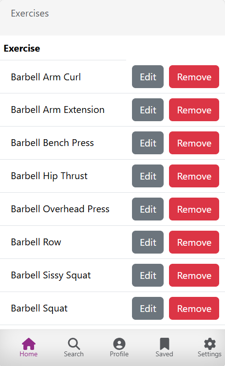
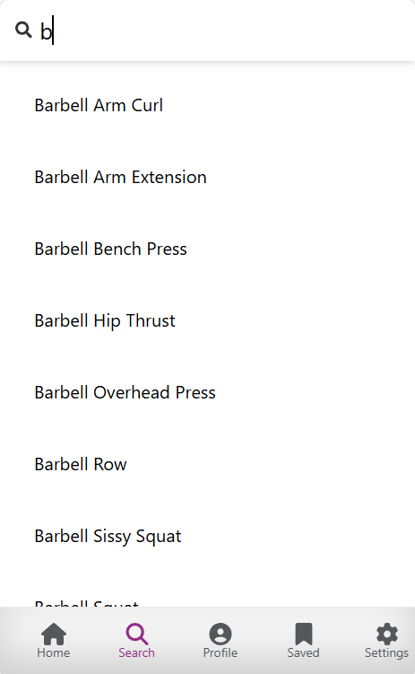
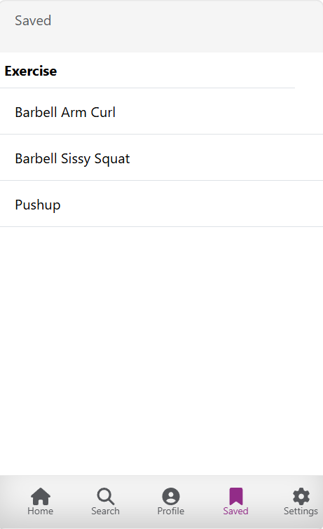

# Fitness App 

Unified project workspace containing the Fit2Go mobile web frontend and the Django REST backend. 

**Live app:** [https://fit2go-pro.netlify.app/](https://fit2go-pro.netlify.app/)

## Screenshots

> Add screenshots to a `screenshots/` folder in this repo, then update the paths below.





## Project Components

- `nutrition-app/` -> frontend repository (React mobile web app)
- `nutrition-backend/` -> backend repository (Django REST API)

## Tools, Languages, and Frameworks

### Frontend

- **JavaScript (ES6+)** — the programming language the frontend is written in
- **React 18** — a JavaScript library for building the user interface and managing page state
- **React Router DOM** — handles navigation between different pages without reloading the browser
- **Axios** — used to send HTTP requests from the frontend to the backend API
- **Bootstrap and Reactstrap** — pre-built styling components for a consistent mobile-friendly layout
- **Google OAuth** — allows users to sign in with their Google account instead of creating a separate password
- **Node.js and npm** — required to run and build the React app locally
- **Netlify** — hosts and serves the frontend publicly

### Backend

- **Python 3.11+** — the programming language the backend is written in
- **Django 4.2** — a Python web framework that handles routing, logic, and the database layer
- **Django REST Framework** — extends Django to build a JSON API that the frontend communicates with
- **Token Authentication (DRF auth token)** — secures the API so only logged-in users can access their data
- **django-cors-headers** — allows the frontend (on a different domain) to communicate with the backend
- **WhiteNoise** — serves static files efficiently in production without a separate file server
- **Gunicorn** — a production-grade web server that runs the Django app on Render
- **SQLite** — a lightweight database used during local development (no setup required)
- **PostgreSQL** — a more robust database used in production on Render
- **Render** — hosts and runs the backend API publicly

### General

- **Git and GitHub** — version control and remote code storage
- **VS Code** — code editor used during development

## Mobile App Notice

Fit2Go is a mobile app experience delivered through the browser.

When testing on desktop browsers, use the Inspect popup and switch to mobile mode:

1. Open the app in Chrome or Edge.
2. Right-click the page and select **Inspect** (a side panel opens).
3. In the Inspect panel, click the **phone/tablet icon** (Toggle device toolbar).
4. Pick a mobile device from the top dropdown (for example iPhone or Pixel).
5. Refresh the page and continue testing in mobile view.

## Key Features

- Browse and search a library of exercises by name
- Create, edit, and delete your own custom exercise records
- Bookmark exercises for quick access later
- Sign in with Google — no separate account or password needed
- User-specific data — your records are private and only visible to you
- Mobile-first design — built and optimised for use on a phone screen
- Data persists between sessions — your exercises and bookmarks are saved to a database

## Prerequisites

Install before setup:

- Git
- Node.js 18+ and npm
- Python 3.11+ and pip

Verify:

```bash
git --version
node -v
npm -v
python --version
pip --version
```

## Step-by-Step Setup

### 1. Open Workspace Root

```bash
cd "Fitness App"
```

### 2. Setup Backend

```bash
cd nutrition-backend
python -m venv .venv
.\.venv\Scripts\Activate.ps1
pip install -r requirements.txt
python manage.py migrate
python manage.py loaddata exercise.json
python manage.py runserver
```

Backend runs at `http://localhost:8000`.

### 3. Setup Frontend

Open a new terminal:

```bash
cd "Fitness App/Fit2go/nutrition-app"
npm install
```

Create `.env.local` with:

```env
REACT_APP_BACKEND_URL=http://localhost:8000
```

Run frontend:

```bash
npm start
```

Frontend runs at `http://localhost:3000`.

### 4. Validate End-to-End

- Ensure backend terminal is running
- Open frontend in browser
- Switch to mobile viewport in inspect mode
- Confirm exercise list loads from API

---

## Deploying the App (Public)

The app has two parts that each need to be deployed separately: the **backend** on Render and the **frontend** on Netlify.

### Prerequisites

- Both `nutrition-app/` and `nutrition-backend/` pushed to a GitHub repository
- A free [Render](https://render.com) account
- A free [Netlify](https://app.netlify.com) account

### 1. Deploy the Backend on Render

- Go to [render.com](https://render.com) and sign in
- Click **New** → **Web Service**
- Connect your GitHub account and select your repository
- If the repo contains both folders, set the **Root Directory** to `nutrition-backend`
- Configure the service:
  - **Build command:** `./build.sh`
  - **Start command:** `gunicorn nutrition_app.wsgi:application`
  - **Environment:** Python
- Under **Environment Variables**, add:
  - `SECRET_KEY` — a long random string used by Django for security
  - `DEBUG` — set to `False`
  - `ALLOWED_HOSTS` — your Render URL (e.g. `your-app.onrender.com`)
- Click **Create Web Service** and wait for the build to finish
- Copy your backend URL — you will need it in the next step

### 2. Deploy the Frontend on Netlify

- Go to [app.netlify.com](https://app.netlify.com)
- Click **Add new site** → **Import an existing project** → **GitHub**
- Select your repository
- If the repo contains both folders, set the **Base directory** to `nutrition-app`
- Configure the build:
  - **Build command:** `npm run build`
  - **Publish directory:** `build`
- Under **Environment Variables**, add:
  - `REACT_APP_BACKEND_URL` — set to your Render backend URL from step 1
- Click **Deploy site**

### 3. Open the Live App

- Your app will be live at your Netlify URL (e.g. `https://fit2go-pro.netlify.app`)
- Open it in a mobile browser, or use Chrome's mobile viewport in Inspect mode (see Mobile App Notice above)

---

## User Data and Privacy

Exercise items are user-specific. When a user signs in with Google, their created exercises and bookmarks are linked only to their account. One user's data is completely separate from another user's — no one can see or edit records that do not belong to them.

## Troubleshooting

- **Exercise list does not load**
  - Confirm the backend is running locally at `http://localhost:8000`, or check your Render deployment logs
  - Confirm `REACT_APP_BACKEND_URL` is set correctly in `.env.local` (local) or in Netlify environment variables (deployed)
- **Google login fails**
  - Ensure your Google OAuth credentials include the correct authorised redirect URIs for your environment
- **Backend migration errors on startup**
  - Run `python manage.py migrate` to apply any pending database migrations
- **`npm install` fails**
  - Confirm Node.js 18+ is installed: `node -v`
- **Port already in use**
  - Stop any existing process on port 8000 (backend) or 3000 (frontend) before starting again

## Project Structure

```text
Fitness-App/
  nutrition-app/
    public/
    src/
      components/
      constants/
      App.js
    package.json
  nutrition-backend/
    main_app/
    nutrition_app/
    manage.py
    requirements.txt
    build.sh
```

## Summary

Built a mobile-first fitness web application where users can browse, search, create, edit, delete, and bookmark exercise records. The frontend is a React app styled with Bootstrap and secured with Google OAuth, served through Netlify. The backend is a Django REST API with token-based authentication, connected to a SQLite database locally and PostgreSQL in production on Render.


